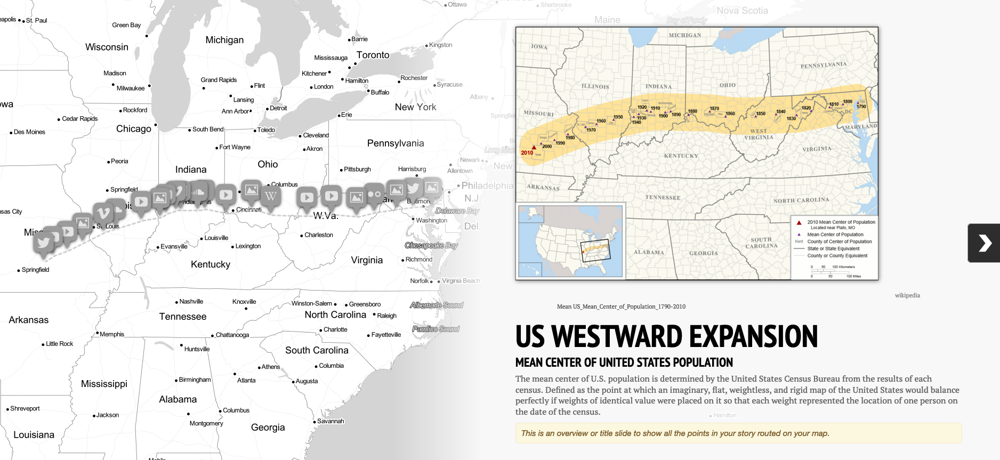

# Extending Twine

There are a number of tools that allow you to embed content into Twine projects with minimal knowledge of css, html, or javascript. The most straightforward way to embed content without technical know-how is through the use of iframes.

[Knightlab projects](https://knightlab.northwestern.edu/projects/) are a particularly great option for this approach.

* [Juxtapose](https://juxtapose.knightlab.com/) lets you show comparison images overlaid on each other (eg. a before and after shot).

<iframe frameborder="0" class="juxtapose" width="100%" height="360" src="https://cdn.knightlab.com/libs/juxtapose/latest/embed/index.html?uid=d09ddd24-013c-11ec-abb7-b9a7ff2ee17c"></iframe>

* [Timeline.js](https://timeline.knightlab.com/) is designed to give you a quick narrative timeline of events.

<iframe src='https://cdn.knightlab.com/libs/timeline/latest/embed/?source=1cWqQBZCkX9GpzFtxCWHoqFXCHg-ylTVUWlnrdYMzKUI&font=Bevan-PotanoSans&maptype=toner&width=600&height=600' width='600' height='600' frameborder='0'></iframe>

* [StoryMap.js](https://storymap.knightlab.com/) lets you represent a sequence of events on a map.

All of these tools can be inserted into your twine project directly using iframes in the text field of a path element.

Iframes are generally less secure than other ways of including information but this is less of an issue with static websites. Note that iframes reliant on external services are also breakable.
{: .note}
