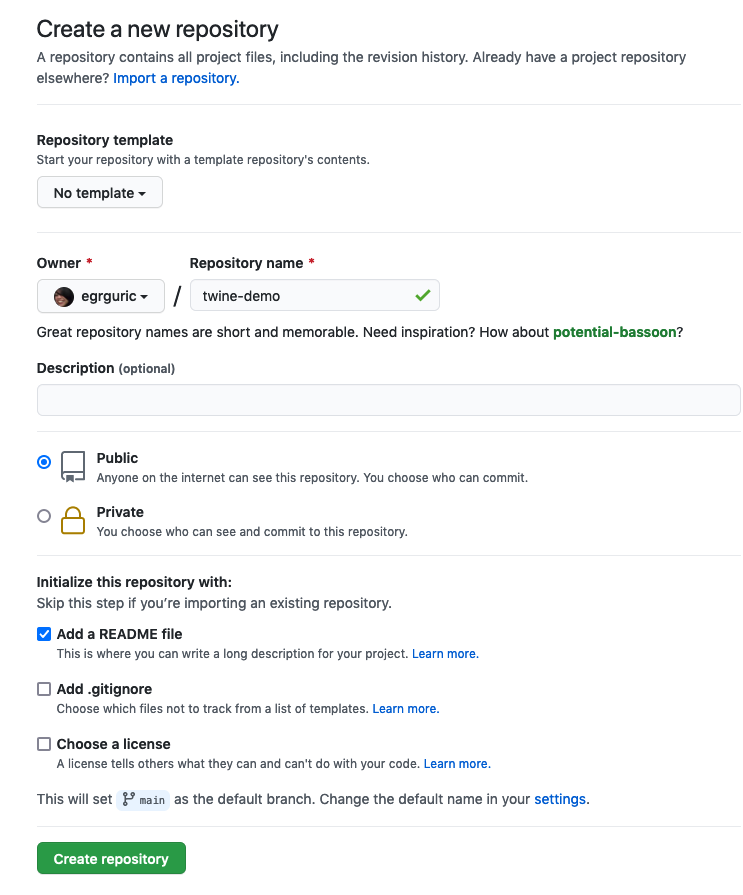
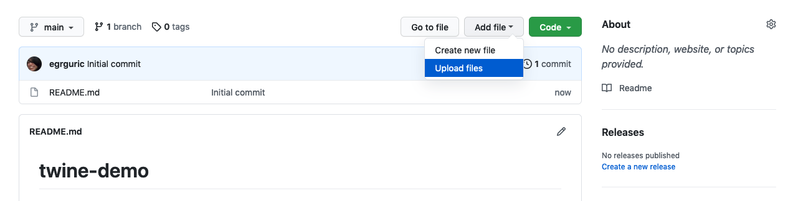
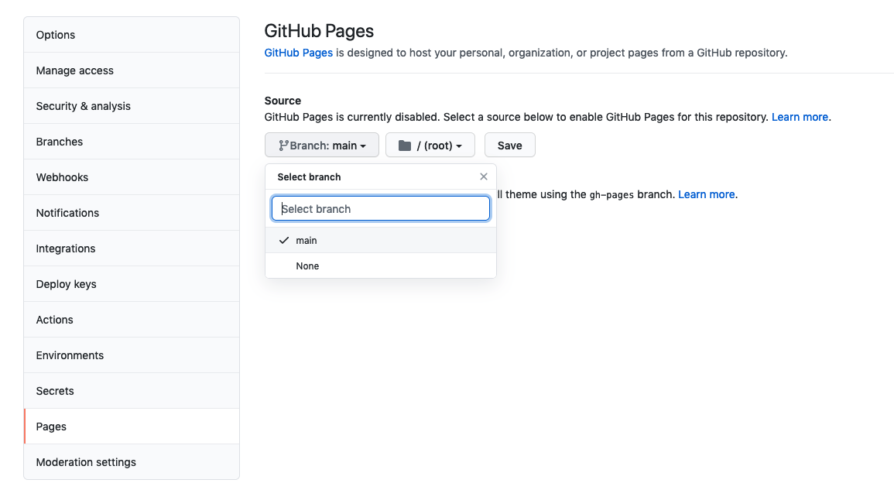
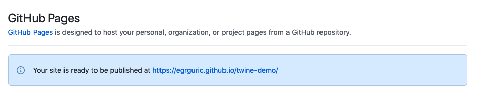
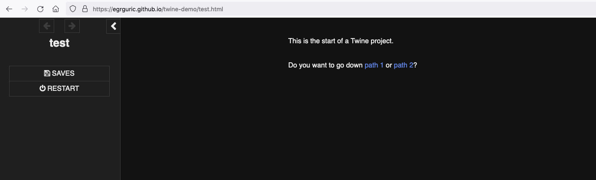

# Getting Started

There are two ways to get started with Twine:
* [online editor](https://twinery.org/2/)
* [local download](https://twinery.org/)

The ***online editor*** has the benefit that you don't need to install anything to get started. Any files you create can be downloaded and later used with either the online editor or the local version of the software (if you choose to download in the future).

The ***local download*** gives you a bit of persistence for your project (eg. if you accidentally close a browser tab in the online version you could lose your work).

## Where are files saved?
From the [Twine documentation](https://twinery.org/cookbook/questions/stories_saved.html):

**Online** - "Stories are saved in the local storage of a web browser. This is isolated between a browser and its use of incognito or private windows. Clearing sessions and cookies in a browser may also clear the storage of Twine 2. Using a different browser also means accessing different local storage."

To save your work online go to your "home" view (by clicking on the little house in the bottom left hand corner of your editing screen). Click on the settings cog of the story that you want to save and select "Publish to file". This will create an html document of your story that will appear in your "Downloads" folder. To continue working on this same file at a later date you can use the "Import From File" feature in the right hand menu options.

Always save your work when using the Online editor, especially clearing your cache.
{: .warn}

**Desktop** - "When used as a desktop application, Twine 2 stores its files under the current user's files. The current collection of Stories can be accessed through the View -> Show Story Library menu option."

This means that files are stored wherever you normally save your files (eg. Documents if that's your default folder for files). Twine will create a new folder called "Twine" in that default location (eg. Documents) and you will be able to find saved .html files of your Twine stories in a sub-folder called "Stories".
{: .note}

## Adding content
For simplicity's sake, use the Twine editor to add content. You are able to directly edit the generated .html file but unless you are comfortable editing HTML and Javascript, this can come with a steeper learning curve.

Here are some common commands:

* [Linking Passages](https://twinery.org/cookbook/starting/twine2/creatinglinks.html)
    * Link to new passage use [[link text]], this auto-generates a passage with the same title as the link text
        * If you want a new passage with a different name to the link use a pipe like so [[link text|different name]]
    * Link to existing passage [[link text->passage name]] (this is called routing)

* Text formatting
    * //italics//
    * "bold"
    * _underline_
    * # Header 1
    * ## Header 2
    * ### Header 3
    * You can use a CSS file or in-line styling to change text colour and style

* Inserting images
    * To insert an image as is [img[name-of-image.png]]
    * To use an inserted image as a link to a passage [img[name-of-image.png][New Passage]]

You can always use HTLM in Twine as well. Whether it's inserting an iframe or using it for styling, Twine will accept HTML in the text editor.

## Publishing to the web through GitHub Pages

[GitHub Pages](https://pages.github.com/) is a way to publish static websites.

*1*{: .circle .circle-blue} Go to GitHub.com and create a new repository. Make sure to "initialise with a Read.me". Note that the name of the repository will eventually be a part of your story url.

*2*{: .circle .circle-blue} Find your Twine file (your-story-name.html) and upload it to the new repository on GitHub

*3*{: .circle .circle-blue} In your GitHub repository go to "Settings" and then "Pages" in the left hand menu. From there select the "main" branch under "Source" and "Save" your change. It might take a few minutes for this to complete but eventually a url will appear on this page. This is the location of your new website.

*4*{: .circle .circle-blue} Go to your twine story by entering the url of your new GitHub Pages site at "your-username.github.io/your-repository-name/your-twine-story-name.html"

Note that a lot of Twine projects also get published to itch.io if they fall into the "game" category. Consider the goals of your project and your intended audience when publishing. GitHub Pages is a handy catch-all for items you just want to get on the web but may not fit into these other venues yet.
{: .note}
